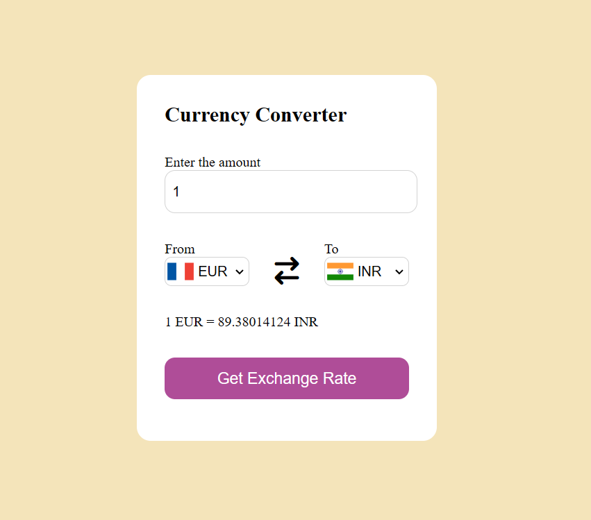

# Currency Converter

**Currency Converter** is a lightweight web application for converting currencies in real time, built with HTML, CSS, and JavaScript. Enjoy seamless usability across devices with its responsive design.

## Features

- Supports conversion between various currencies.
- Real-time exchange rate updates.
- User-friendly interface with intuitive design.
- Mobile-responsive layout for easy access on different devices.

## Technologies Used

- HTML5
- CSS3
- JavaScript

## How to Use

1. Clone this repository to your local machine:
    git clone https://github.com/your-username/currency-converter.git
2. Open `index.html` in your web browser.

4. Choose the currency you want to convert from and to.

5. Enter the amount you wish to convert.

6. The converted amount will be displayed instantly.

## Contributions

Contributions are welcome! Feel free to fork this project and submit pull requests for any improvements or additional features you'd like to add.
